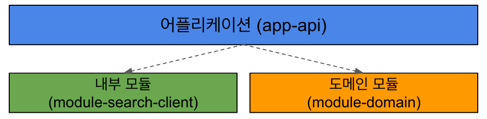

# blog-search-service

## 주요 기술스택
* SpringBoot3.0.4
* Java17
* Gradle7.6.1
* JPA
* H2
* Redis
  * 인기 검색어 목록을 조회 시, DB 부하를 줄이기 위해 캐시 역할을 하도록 함

## 외부 라이브러리 및 오픈소스
* Jackson
  * 데이터 프로세싱에 사용
* OpenFeign
  * 외부 API 호출에 사용
* Bucket4j
  * 대용량 트래픽 제어를 위함
* Guava
  * 가독성 있는 코드를 구현하고자 했지만 중요하게 사용되진 않음

## 추가 특이사항
* 인기 검색어와 관련한 동시성 이슈를 해결하고자 낙관적 락을 사용

## API 명세
### GET /blog
#### Request
| 파라미터명 | 설명                                | 필수 여부 | 기본값  |
|-------|-----------------------------------|-------|------|
| query | 검색어                               | O     |      |
| page  | 페이지 번호                            | X     | 1    |
| sort  | 정렬 기준 (정확도순: accu / 최신순: recency) | X     | accu |
| size  | 페이지 크기                            | X     | 10   |
```
GET /blog?query=개발자&page=1&sort=accu&size=10
```
#### Response
| 필드명       | 설명             |
|-----------|----------------|
| title     | 블로그 게시물 제목     |
| contents  | 블로그 게시물 내용 스니펫 |
| dateTime  | 블로그 게시 날짜 및 시간 |
| thumbnail | 블로그 게시물 썸네일 주소 |
| url       | 블로그 게시물 url    |
| blogName  | 블로그 이름         |
```json
[
    {
        "title": "<b>개발자</b> 도구(DevTools) 1000% 활용하기",
        "contents": "<b>개발자</b> 도구에서 element 나 콘솔, network, 쿠키 등을 보는 방법을 알고는 있지만 자세하게 하나하나 알아본 적은 없어서 공부하고 글을 써본다.!!! 모두에게 유용한 글이 되길!!!! 1. <b>개발자</b> 도구(DevTools)란???? 브라우저에서 제공하는 하나의 도구. 웹 사이트를 즉각적으로 수정하고 문제의 원인을 파악하기...",
        "dateTime": "2023.03.17 17:18:25",
        "thumbnail": "https://search4.kakaocdn.net/argon/130x130_85_c/HGtjt9NsQz6",
        "url": "http://fopman.tistory.com/16",
        "blogName": "내가 바로 열정맨"
    },
    ...
]
```
### GET /hot-keyword
#### Request
```
GET /hot-keyword
```
#### Response
| 필드명         | 설명          |
|-------------|-------------|
| keyword     | 인기 검색어 키워드  |
| searchCount | 해당 키워드 검색 수 |
```json
[
    {
        "keyword": "개발자",
        "searchCount": 15
    },
    {
        "keyword": "Java",
        "searchCount": 12
    },
    ...
]
```
### 상태 코드
* 200: 성공적인 응답
* 400: 잘못된 요청
* 429: 트래픽이 과하게 몰릴 경우 응답
* 500: 서버 에러

## 프로젝트 구조

* module-search-client: 외부 API를 호출하는 client를 위한 모듈
* module-domain: 저장소와 밀접한 중심 도메인을 위한 모듈
```bash
.
├── README.md
├── app-api
│   ├── build.gradle
│   └── src
│       ├── main
│       │   ├── java
│       │   │   └── com
│       │   │       └── example
│       │   │           └── blogsearchservice
│       │   │               ├── AppApiApplication.java
│       │   │               ├── config
│       │   │               │   └── BucketConfig.java
│       │   │               ├── controller
│       │   │               │   └── BlogSearchController.java
│       │   │               ├── dto
│       │   │               │   └── HotKeywordInfo.java
│       │   │               ├── exception
│       │   │               │   ├── ExceedTrafficException.java
│       │   │               │   └── WebEndpointExceptionHandler.java
│       │   │               └── service
│       │   │                   ├── BlogSearchFacade.java
│       │   │                   └── BlogSearchService.java
│       │   └── resources
│       │       └── application.properties
│       └── test
│           ├── java
│           │   └── com
│           │       └── example
│           │           └── blogsearchservice
│           │               ├── AppApiApplicationTests.java
│           │               ├── controller
│           │               │   └── BlogSearchControllerTest.java
│           │               └── service
│           │                   ├── BlogSearchFacadeIntegrationTest.java
│           │                   ├── BlogSearchServiceTest.java
│           │                   └── RedisServiceTest.java
│           └── resources
│               ├── application-api-test.properties
│               └── application.properties
├── build.gradle
├── module-domain
│   ├── build.gradle
│   ├── gradle
│   │   └── wrapper
│   │       ├── gradle-wrapper.jar
│   │       └── gradle-wrapper.properties
│   └── src
│       ├── main
│       │   ├── java
│       │   │   └── com
│       │   │       └── example
│       │   │           └── blogsearchservice
│       │   │               ├── config
│       │   │               │   ├── LocalRedisConfig.java
│       │   │               │   └── RedisConfig.java
│       │   │               ├── domain
│       │   │               │   └── SearchKeyword.java
│       │   │               ├── repository
│       │   │               │   └── SearchKeywordRepository.java
│       │   │               └── service
│       │   │                   └── RedisService.java
│       │   └── resources
│       │       └── application-domain.properties
│       └── test
│           └── java
│               └── com
│                   └── example
│                       └── blogsearchservice
│                           └── ModuleDomainApplicationTests.java
├── module-search-client
│   ├── build.gradle
│   └── src
│       ├── main
│       │   ├── java
│       │   │   └── com
│       │   │       └── example
│       │   │           └── blogsearchservice
│       │   │               ├── client
│       │   │               │   ├── KakaoFeignClient.java
│       │   │               │   └── NaverFeignClient.java
│       │   │               ├── dto
│       │   │               │   ├── BlogSearchApiResult.java
│       │   │               │   ├── FetcherRequestContext.java
│       │   │               │   ├── KakaoBlogSearchResult.java
│       │   │               │   └── NaverBlogSearchResult.java
│       │   │               ├── fetcher
│       │   │               │   ├── KakaoBlogSearchFetcher.java
│       │   │               │   └── NaverBlogSearchFetcher.java
│       │   │               ├── service
│       │   │               │   ├── BlogFetchHandler.java
│       │   │               │   ├── FetcherFactory.java
│       │   │               │   ├── KakaoBlogSearchFetchHandler.java
│       │   │               │   └── NaverBlogSearchFetchHandler.java
│       │   │               └── util
│       │   │                   ├── KakaoBlogSearchSort.java
│       │   │                   └── NaverBlogSearchSort.java
│       │   └── resources
│       │       └── application-client.properties
│       └── test
│           └── java
│               └── com
│                   └── example
│                       └── blogsearchservice
│                           ├── ModuleSearchClientApplicationTests.java
│                           └── service
│                               └── BlogSearchFetcherTest.java
└── settings.gradle
```
